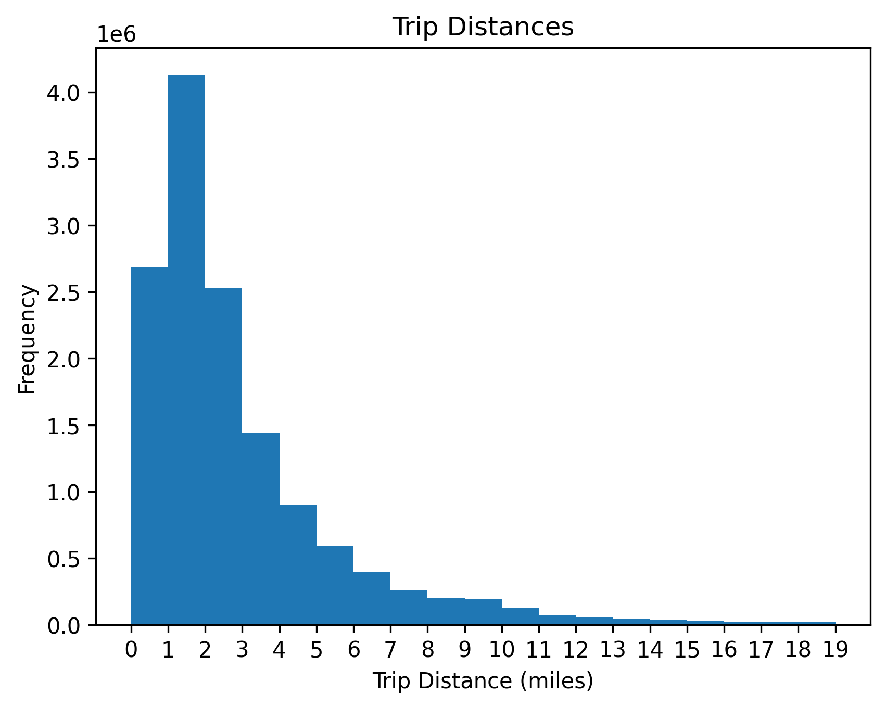
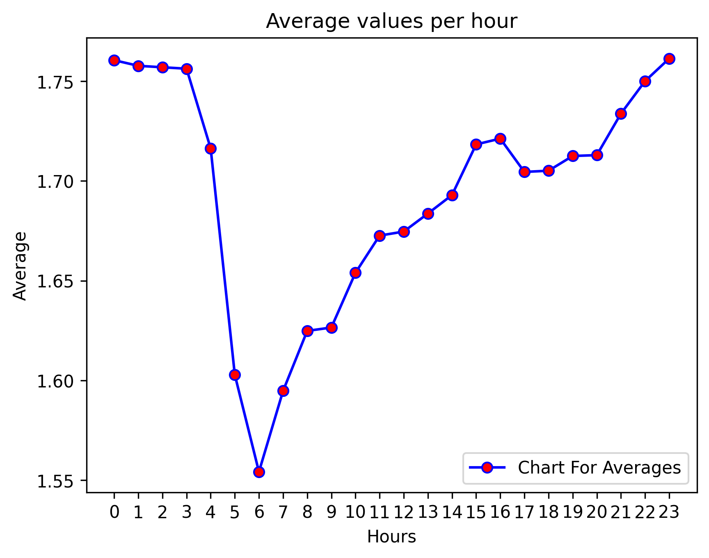
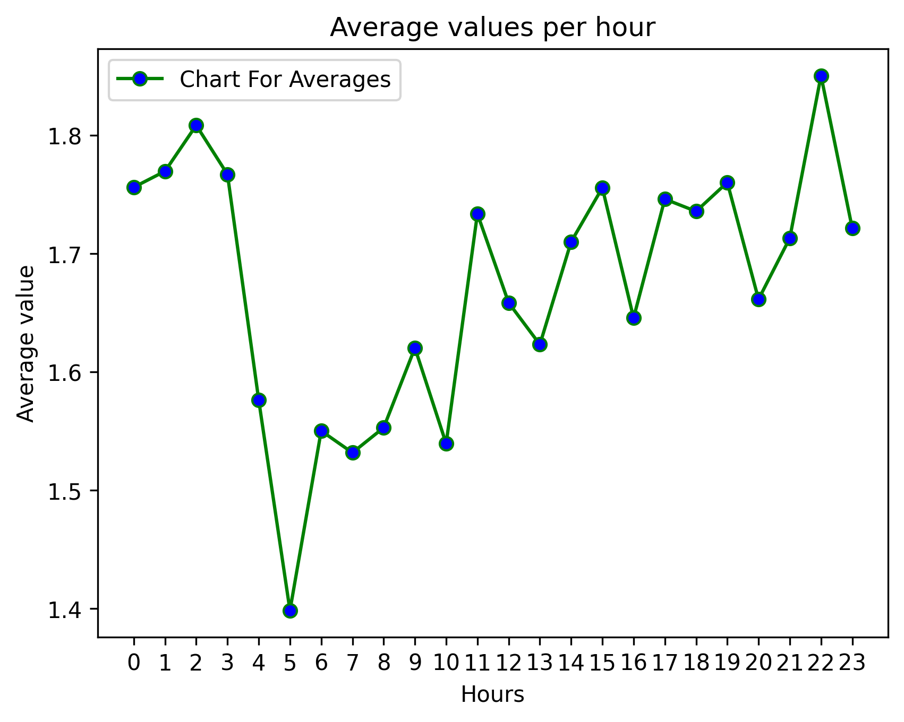

# NYC Taxi Data Analysis

This repository contains an analysis of NYC taxi trip data, focusing on patterns and insights extracted from the February 2013 dataset. The project demonstrates various data manipulation, visualization, and analysis techniques.

---

## Features
- **Big Data Inspection**: Handles millions of rows of taxi trip data.
- **Data Visualization**: Includes histograms, line plots, and geographic mapping.
- **Data Reduction**: Reduces large datasets for faster computation.
- **Geographic Analysis**: Explores latitude/longitude patterns using maps.

---

## Visualizations
### Geographic Range of Data


### Trip Distance Histogram


### Average Passengers Per Hour (Full Dataset)


### Average Passengers Per Hour (Reduced Dataset)


---

## Data Description
### Fields in the Dataset
1. **medallion**: Unique ID for the taxi.
2. **hack_license**: Driver’s license ID.
3. **vendor_id**: ID of the service provider.
4. **rate_code**: Fare calculation method.
5. **store_and_fwd_flag**: Whether the trip was delayed in transmission.
6. **pickup/dropoff_datetime**: Start/end times of the trip.
7. **passenger_count**: Number of passengers.
8. **trip_time_in_secs**: Duration of the trip.
9. **trip_distance**: Distance traveled.
10. **pickup/dropoff_longitude/latitude**: Start/end GPS coordinates.

---

## Installation

1. Clone the repository:
   ```bash
   git clone https://github.com/your_username/NYC-Taxi-Data-Analysis.git

2. Navigate into the project directory:
   ```bash
   cd NYC-Taxi-Data-Analysis
3. Install dependencies:
   ```bash
   pip install -r requirements.txt
4. Open the Jupyter notebook:
   ```bash
   jupyter notebook notebooks/main.ipynb
   
---

## Results
- Insights into passenger patterns per hour of the day.
- Visualizations showing geographic trip ranges and trip distance distribution.
